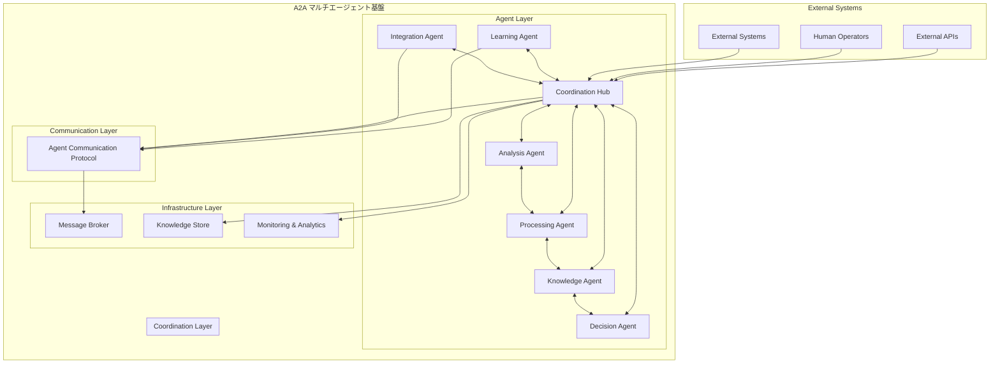
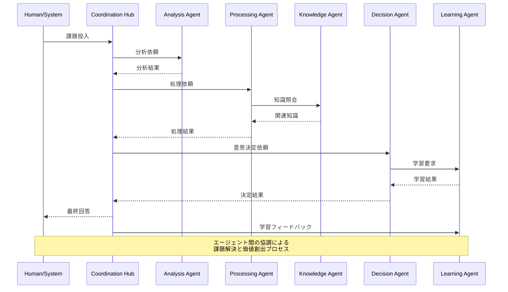
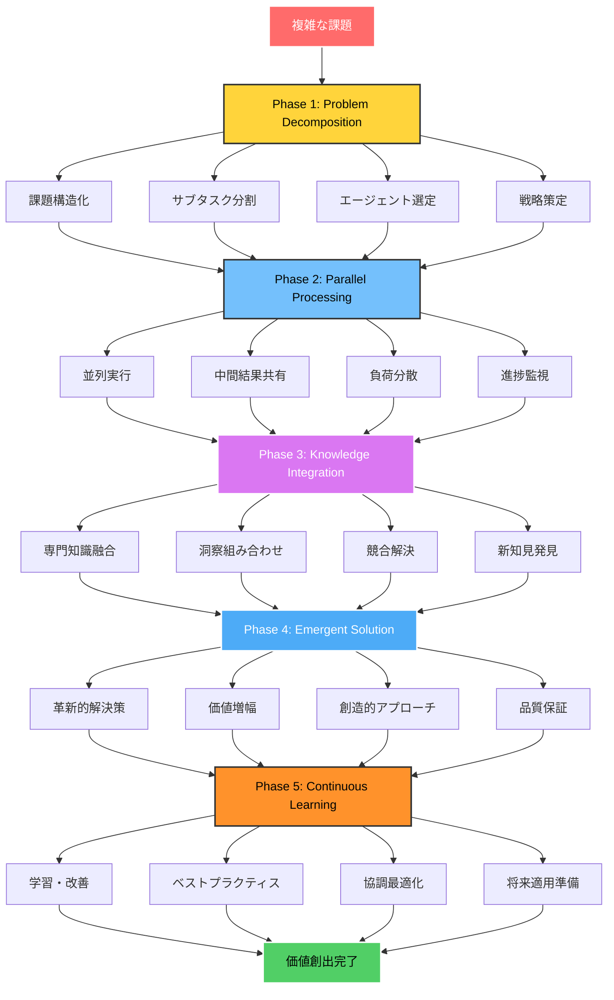
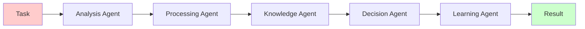
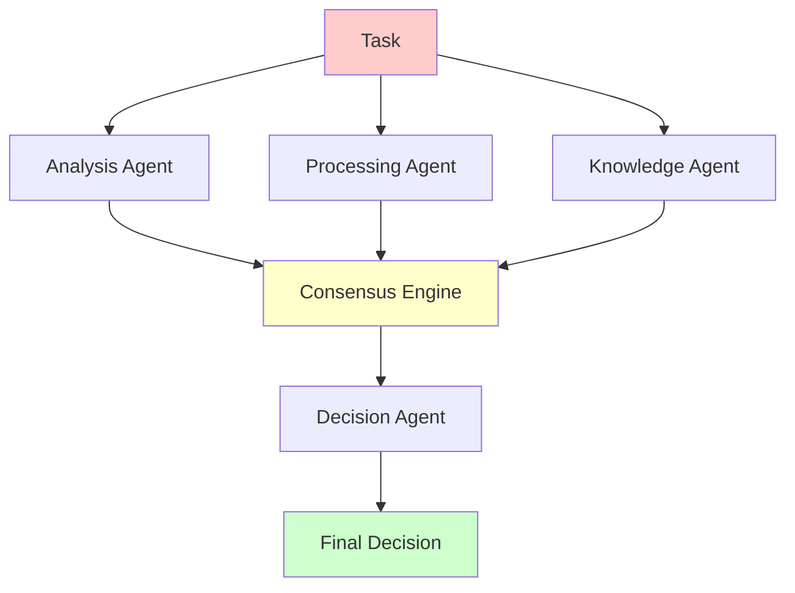
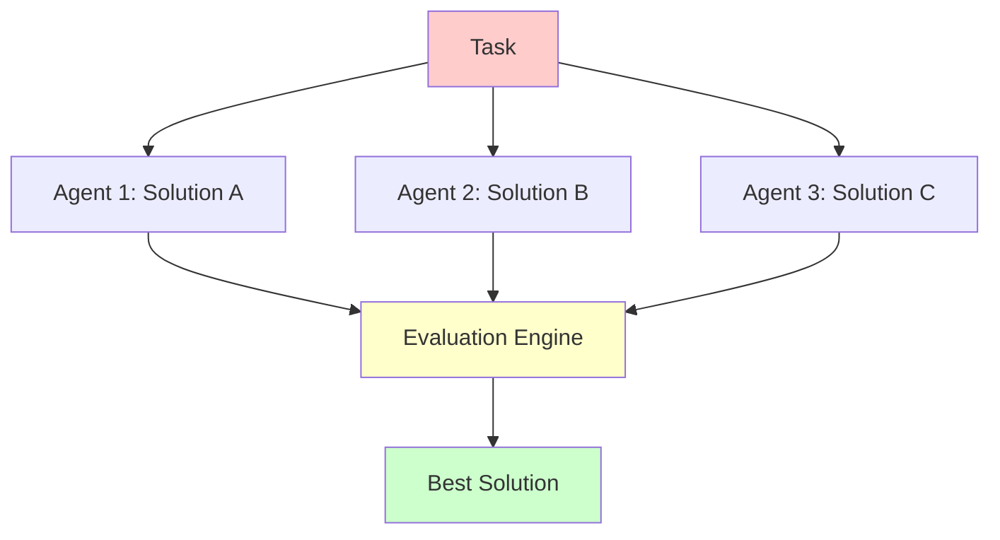
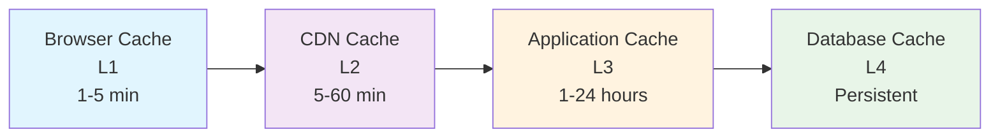
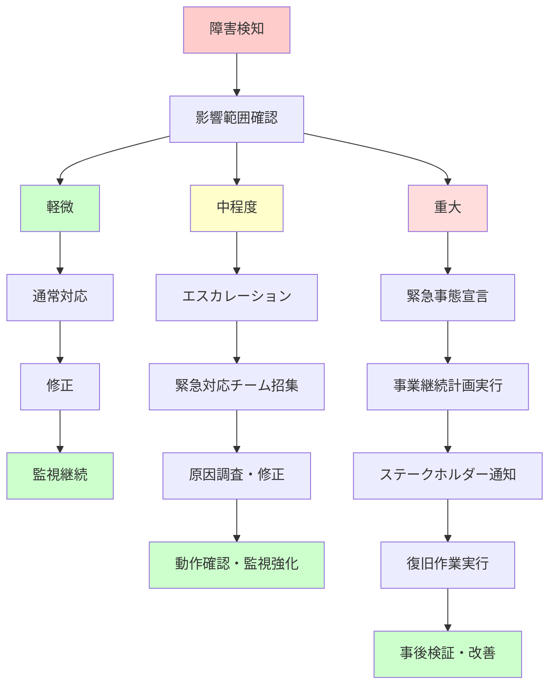

# A2A (Application-to-Application) システム設計書

## 1. 概要

### 1.1 プロジェクト概要
A2A (Agent-to-Agent) システムは、複数の自律的なエージェントが協調して課題解決と価値創出を行うマルチエージェント統合プラットフォームです。各エージェントは専門的な能力を持ち、相互に連携してより複雑な問題に取り組みます。

### 1.2 目的
- **自律的問題解決**: エージェント同士が協調して複雑な課題を分析・解決
- **動的価値創出**: 連携によって単独では不可能な価値を創出
- **適応的学習**: エージェント間の相互作用を通じた継続的な能力向上
- **スケーラブルな協調**: エージェント数の増加に対応した効率的な連携

### 1.3 主要機能

**エージェント協調機能**
- 動的タスク分散とワークロード最適化
- エージェント間の知識共有と学習
- 集合知による意思決定支援
- リアルタイム協調とフィードバック

**価値創出メカニズム**
- 課題の自動分解と専門エージェントへの割り当て
- 多角的アプローチによる解決策生成
- エージェント間のアイデア融合と創発
- 継続的改善とベストプラクティス蓄積

**システム基盤機能**
- エージェント間メッセージング・プロトコル
- 分散処理とリソース管理
- セキュリティと認証・認可
- 監視・分析・最適化

## 2. アーキテクチャ

### 2.1 マルチエージェントシステム構成図



### 2.1.1 エージェント種別と役割

#### 専門エージェント
```
┌─────────────────────────────────────────────────────────────┐
│                      エージェント分類                        │
├─────────────────────────────────────────────────────────────┤
│ 1. Analysis Agent (分析エージェント)                         │
│    ├─ 課題の構造化と分解                                     │
│    ├─ データパターン分析                                     │
│    ├─ リスク・機会の特定                                     │
│    └─ 解決アプローチの提案                                   │
│                                                             │
│ 2. Processing Agent (処理エージェント)                      │
│    ├─ データ変換・統合処理                                   │
│    ├─ 計算・シミュレーション実行                             │
│    ├─ ワークフロー処理                                       │
│    └─ リアルタイム処理対応                                   │
│                                                             │
│ 3. Knowledge Agent (知識エージェント)                       │
│    ├─ 知識ベース構築・管理                                   │
│    ├─ ベストプラクティス蓄積                                 │
│    ├─ 学習結果の統合                                         │
│    └─ 専門知識の提供                                         │
│                                                             │
│ 4. Decision Agent (意思決定エージェント)                    │
│    ├─ 多基準意思決定支援                                     │
│    ├─ リスク評価・管理                                       │
│    ├─ 最適解の選択                                           │
│    └─ 戦略立案支援                                           │
│                                                             │
│ 5. Integration Agent (統合エージェント)                     │
│    ├─ 外部システム連携                                       │
│    ├─ API・データ統合                                        │
│    ├─ プロトコル変換                                         │
│    └─ レガシーシステム対応                                   │
│                                                             │
│ 6. Learning Agent (学習エージェント)                        │
│    ├─ パフォーマンス分析                                     │
│    ├─ パターン学習・予測                                     │
│    ├─ 改善提案生成                                           │
│    └─ 適応的最適化                                           │
└─────────────────────────────────────────────────────────────┘
```

#### Coordination Hub (協調ハブ)
```
┌─────────────────────────────────────────────────────────────┐
│                   協調ハブの主要機能                          │
├─────────────────────────────────────────────────────────────┤
│ 1. Task Orchestration (タスクオーケストレーション)           │
│    ├─ 課題の自動分解と割り当て                               │
│    ├─ エージェント能力とタスクのマッチング                   │
│    ├─ 優先度管理と負荷分散                                   │
│    └─ 進捗監視と調整                                         │
│                                                             │
│ 2. Collaboration Protocol (協調プロトコル)                  │
│    ├─ エージェント間通信管理                                 │
│    ├─ 合意形成メカニズム                                     │
│    ├─ 競合・デッドロック回避                                 │
│    └─ 同期・非同期処理制御                                   │
│                                                             │
│ 3. Value Integration (価値統合)                             │
│    ├─ 部分解の統合・融合                                     │
│    ├─ 創発的価値の抽出                                       │
│    ├─ 品質保証・検証                                         │
│    └─ 最終成果物の生成                                       │
│                                                             │
│ 4. Dynamic Adaptation (動的適応)                            │
│    ├─ 実行時エージェント追加・削除                           │
│    ├─ 戦略の動的変更                                         │
│    ├─ 障害時のフェイルオーバー                               │
│    └─ 負荷状況に応じたスケーリング                           │
└─────────────────────────────────────────────────────────────┘
```

### 2.1.2 エージェント協調シーケンス図



### 2.1.3 価値創出プロセス



## 2.2 エージェント間コミュニケーションプロトコル

### 2.2.1 メッセージ形式とプロトコル
```javascript
// A2A Agent Communication Protocol (AACP)
const AgentMessage = {
  header: {
    messageId: "uuid",
    timestamp: "2024-01-01T00:00:00Z",
    fromAgent: {
      id: "agent-001",
      type: "analysis",
      capabilities: ["data-analysis", "pattern-recognition"]
    },
    toAgent: {
      id: "agent-002", 
      type: "processing",
      capabilities: ["data-transformation", "computation"]
    },
    messageType: "request|response|notification|collaboration",
    priority: "high|medium|low",
    correlationId: "uuid", // 関連メッセージのグループ化
    ttl: 3600000 // メッセージの有効期限(ms)
  },
  payload: {
    taskId: "task-001",
    action: "analyze|process|decide|integrate|learn",
    context: {
      originalProblem: "問題の詳細説明",
      currentPhase: "decomposition|processing|integration|solution|learning",
      dependencies: ["task-002", "task-003"], // 依存タスク
      constraints: {
        timeLimit: 300000, // 5分
        resourceLimit: "cpu:2,memory:4GB",
        qualityThreshold: 0.85
      }
    },
    data: {
      input: {}, // 入力データ
      parameters: {}, // 処理パラメータ
      metadata: {} // メタデータ
    },
    collaboration: {
      requiredAgents: ["knowledge", "decision"], // 必要な協力エージェント
      collaborationType: "sequential|parallel|consensus", 
      consensusThreshold: 0.7 // 合意形成の閾値
    }
  },
  security: {
    signature: "digital-signature",
    permissions: ["read", "write", "execute"],
    classification: "public|internal|confidential"
  }
};
```

### 2.2.2 協調パターン

#### パターン1: Pipeline協調



#### パターン2: Consensus協調



#### パターン3: Competitive協調



### 2.2.3 動的エージェント発見と協調

```javascript
class AgentDiscoveryService {
  constructor() {
    this.agentRegistry = new Map();
    this.capabilityIndex = new Map();
    this.collaborationHistory = new Map();
  }
  
  // エージェント登録
  registerAgent(agent) {
    this.agentRegistry.set(agent.id, {
      id: agent.id,
      type: agent.type,
      capabilities: agent.capabilities,
      currentLoad: 0,
      maxLoad: agent.maxLoad,
      performance: {
        successRate: 1.0,
        avgResponseTime: 100,
        qualityScore: 0.9
      },
      availability: 'available', // available|busy|offline
      lastUpdate: new Date()
    });
    
    // 能力インデックスの更新
    agent.capabilities.forEach(capability => {
      if (!this.capabilityIndex.has(capability)) {
        this.capabilityIndex.set(capability, new Set());
      }
      this.capabilityIndex.get(capability).add(agent.id);
    });
  }
  
  // 最適エージェントの選択
  findOptimalAgents(requirements) {
    const candidates = [];
    
    requirements.capabilities.forEach(capability => {
      const capableAgents = this.capabilityIndex.get(capability) || new Set();
      capableAgents.forEach(agentId => {
        const agent = this.agentRegistry.get(agentId);
        if (this.isEligible(agent, requirements)) {
          candidates.push({
            agent,
            score: this.calculateScore(agent, requirements)
          });
        }
      });
    });
    
    // スコア順にソートして最適なエージェントを選択
    return candidates
      .sort((a, b) => b.score - a.score)
      .slice(0, requirements.maxAgents || 3)
      .map(c => c.agent);
  }
  
  calculateScore(agent, requirements) {
    let score = 0;
    
    // パフォーマンススコア (40%)
    score += agent.performance.successRate * 0.4;
    
    // 負荷状況 (30%)
    const loadFactor = 1 - (agent.currentLoad / agent.maxLoad);
    score += loadFactor * 0.3;
    
    // 応答時間 (20%)
    const timeFactor = Math.max(0, 1 - (agent.performance.avgResponseTime / 1000));
    score += timeFactor * 0.2;
    
    // 協調履歴 (10%)
    const collaborationScore = this.getCollaborationScore(agent.id, requirements);
    score += collaborationScore * 0.1;
    
    return score;
  }
  
  // 協調グループの動的形成
  formCollaborationGroup(taskId, requirements) {
    const selectedAgents = this.findOptimalAgents(requirements);
    
    const collaborationGroup = {
      id: generateId(),
      taskId,
      agents: selectedAgents,
      coordinator: this.selectCoordinator(selectedAgents),
      createdAt: new Date(),
      strategy: this.determineStrategy(requirements),
      communicationProtocol: this.setupProtocol(selectedAgents)
    };
    
    // 協調グループの初期化
    this.initializeCollaboration(collaborationGroup);
    
    return collaborationGroup;
  }
}
```

### 2.2.4 合意形成メカニズム

```javascript
class ConsensusEngine {
  constructor() {
    this.votingStrategies = {
      majority: this.majorityVoting,
      weighted: this.weightedVoting,
      byzantine: this.byzantineFaultTolerant,
      expertise: this.expertiseBasedVoting
    };
  }
  
  async reachConsensus(proposals, agents, strategy = 'weighted') {
    const votingFunction = this.votingStrategies[strategy];
    
    // 提案の評価フェーズ
    const evaluations = await this.evaluateProposals(proposals, agents);
    
    // 投票フェーズ
    const votes = await this.collectVotes(evaluations, agents);
    
    // 合意形成
    const consensus = await votingFunction.call(this, votes, agents);
    
    // 結果の検証
    return this.validateConsensus(consensus, agents);
  }
  
  async weightedVoting(votes, agents) {
    const scores = new Map();
    
    votes.forEach(vote => {
      const agent = agents.find(a => a.id === vote.agentId);
      const weight = this.calculateAgentWeight(agent);
      
      vote.rankings.forEach((proposalId, rank) => {
        const score = (vote.rankings.length - rank) * weight;
        scores.set(proposalId, (scores.get(proposalId) || 0) + score);
      });
    });
    
    const sortedProposals = Array.from(scores.entries())
      .sort((a, b) => b[1] - a[1]);
    
    return {
      winningProposal: sortedProposals[0][0],
      confidence: this.calculateConfidence(sortedProposals),
      consensusLevel: this.calculateConsensusLevel(votes),
      alternativeProposals: sortedProposals.slice(1, 3)
    };
  }
  
  calculateAgentWeight(agent) {
    // エージェントの専門性、過去の成功率、経験値を基に重みを計算
    const expertiseWeight = agent.expertiseLevel || 1.0;
    const performanceWeight = agent.performance.successRate;
    const experienceWeight = Math.min(agent.experiencePoints / 1000, 2.0);
    
    return (expertiseWeight + performanceWeight + experienceWeight) / 3;
  }
}
```

## 2.3 マルチエージェント協調の実装例

### 2.3.1 具体的な価値創出シナリオ

**シナリオ: ビジネスプロセス最適化課題**

1. **課題投入**: 「顧客満足度向上とコスト削減を両立する配送プロセス最適化」

2. **エージェント協調プロセス**:
```
┌─────────────────────────────────────────────────────────────┐
│ Analysis Agent: 現状分析                                     │
│ ├─ 配送データの構造化分析                                   │
│ ├─ 顧客満足度要因の特定                                     │
│ ├─ コスト構造の分解                                         │
│ └─ 改善ポイントの洗い出し                                   │
├─────────────────────────────────────────────────────────────┤
│ Processing Agent: シミュレーション                          │
│ ├─ 複数の最適化シナリオ実行                                 │
│ ├─ リアルタイムルート計算                                   │
│ ├─ 需要予測モデル適用                                       │
│ └─ コスト・時間・満足度の同時最適化                         │
├─────────────────────────────────────────────────────────────┤
│ Knowledge Agent: 専門知識提供                               │
│ ├─ 過去の成功事例パターン                                   │
│ ├─ 業界ベストプラクティス                                   │
│ ├─ 規制・制約条件の確認                                     │
│ └─ 技術的実現可能性評価                                     │
├─────────────────────────────────────────────────────────────┤
│ Decision Agent: 統合判断                                    │
│ ├─ 多基準での解決策評価                                     │
│ ├─ リスク・リターン分析                                     │
│ ├─ 実装優先度の決定                                         │
│ └─ ROI予測と投資判断                                        │
├─────────────────────────────────────────────────────────────┤
│ 創発的価値: 統合ソリューション                               │
│ ├─ AIベース動的ルーティング                                │
│ ├─ 顧客体験最適化配送スケジュール                           │
│ ├─ コスト削減30%・満足度向上25%の同時実現                  │
│ └─ 継続的改善メカニズム内蔵                                 │
└─────────────────────────────────────────────────────────────┘
```

3. **学習と改善**:
- 実装結果のリアルタイム監視
- エージェント間協調パターンの最適化
- 新たな課題への適用準備

この設計により、A2Aシステムは従来の単純なアプリケーション間連携を超えて、知的なエージェント同士が協調して課題解決と価値創出を行う次世代プラットフォームとして機能します。

### 2.2 レイヤー構成

#### 2.2.1 プレゼンテーション層

**RESTful API**
- 標準的なHTTPメソッド (GET, POST, PUT, DELETE, PATCH)
- OpenAPI 3.0準拠の仕様書
- バージョニング戦略 (/api/v1/, /api/v2/)
- コンテンツネゴシエーション (JSON, XML, MessagePack)
- HATEOAS (Hypermedia as the Engine of Application State)
- レスポンス形式統一とエラーハンドリング

**GraphQL API**
- 単一エンドポイントでの柔軟なデータ取得
- スキーマファースト設計
- リアルタイムサブスクリプション機能
- データローダーによるN+1問題解決
- フィールドレベルの認可制御
- クエリの複雑度分析と制限

**WebSocket接続**
- リアルタイム双方向通信
- メッセージ配信状況の即座通知
- 接続プールと負荷分散対応
- 自動再接続とハートビート機能
- 圧縮とバイナリデータ対応
- 認証トークンベースの接続制御

**管理コンソール (Admin Dashboard)**
- シングルページアプリケーション (SPA)
- レスポンシブデザイン対応
- ロールベースアクセス制御 (RBAC)
- リアルタイムモニタリング画面
- 設定管理インターフェース
- 監査ログビューア
- システムヘルスダッシュボード

**モバイルアプリ対応**
- Progressive Web App (PWA)
- オフライン機能サポート
- プッシュ通知対応
- ネイティブアプリSDK提供
- モバイル最適化されたAPI設計

**API Gateway機能**
- リクエストルーティング
- レート制限とスロットリング
- リクエスト/レスポンス変換
- 認証・認可の一元化
- APIキー管理
- 使用量分析とレポート
- キャッシュ機能

### 2.2.1.1 プレゼンテーション層アーキテクチャ詳細

#### API設計原則
```
┌─────────────────────────────────────────────────────────────┐
│                    API設計ガイドライン                        │
├─────────────────────────────────────────────────────────────┤
│ 1. RESTful原則                                               │
│    ├─ リソース指向URL設計                                     │
│    ├─ 適切なHTTPステータスコード使用                         │
│    ├─ 冪等性の保証 (GET, PUT, DELETE)                       │
│    └─ 統一されたレスポンス形式                               │
│                                                             │
│ 2. バージョニング戦略                                        │
│    ├─ URLパス: /api/v1/resources                            │
│    ├─ ヘッダー: Accept: application/vnd.api+json;version=1  │
│    ├─ 下位互換性の維持                                       │
│    └─ 廃止予定APIの段階的移行                               │
│                                                             │
│ 3. セキュリティ                                              │
│    ├─ HTTPS必須                                             │
│    ├─ CORS適切な設定                                        │
│    ├─ CSRFトークン                                          │
│    └─ 入力値検証とサニタイゼーション                         │
└─────────────────────────────────────────────────────────────┘
```

#### RESTful API詳細仕様

**標準レスポンス形式**
```json
{
  "status": "success|error",
  "code": 200,
  "message": "操作が正常に完了しました",
  "data": {
    // 実際のデータ
  },
  "meta": {
    "timestamp": "2024-01-01T00:00:00Z",
    "requestId": "uuid",
    "version": "1.0.0"
  },
  "pagination": {
    "page": 1,
    "limit": 20,
    "total": 100,
    "totalPages": 5
  },
  "links": {
    "self": "/api/v1/messages?page=1",
    "next": "/api/v1/messages?page=2",
    "prev": null,
    "first": "/api/v1/messages?page=1",
    "last": "/api/v1/messages?page=5"
  }
}
```

**エラーレスポンス形式**
```json
{
  "status": "error",
  "code": 400,
  "message": "バリデーションエラーが発生しました",
  "errors": [
    {
      "field": "email",
      "code": "INVALID_FORMAT",
      "message": "有効なメールアドレスを入力してください"
    }
  ],
  "meta": {
    "timestamp": "2024-01-01T00:00:00Z",
    "requestId": "uuid",
    "documentation": "https://docs.a2a.com/api/errors"
  }
}
```

#### GraphQL Schema設計

**基本スキーマ構造**
```graphql
type Query {
  # メッセージ関連
  message(id: ID!): Message
  messages(
    filter: MessageFilter
    pagination: PaginationInput
    sort: [MessageSort!]
  ): MessageConnection!
  
  # アプリケーション関連
  application(id: ID!): Application
  applications(filter: ApplicationFilter): [Application!]!
  
  # ワークフロー関連
  workflow(id: ID!): Workflow
  workflows(status: WorkflowStatus): [Workflow!]!
  
  # 統計・レポート
  messageStats(period: TimePeriod!): MessageStats!
  systemHealth: SystemHealth!
}

type Mutation {
  # メッセージ操作
  sendMessage(input: SendMessageInput!): SendMessagePayload!
  retryMessage(id: ID!): RetryMessagePayload!
  
  # アプリケーション管理
  createApplication(input: CreateApplicationInput!): CreateApplicationPayload!
  updateApplication(id: ID!, input: UpdateApplicationInput!): UpdateApplicationPayload!
  
  # ワークフロー管理
  createWorkflow(input: CreateWorkflowInput!): CreateWorkflowPayload!
  executeWorkflow(id: ID!, context: JSON): ExecuteWorkflowPayload!
}

type Subscription {
  # リアルタイム更新
  messageStatusUpdated(messageId: ID): MessageStatusUpdate!
  queueDepthChanged(queueName: String!): QueueDepthUpdate!
  systemAlerts: SystemAlert!
  workflowProgress(workflowId: ID!): WorkflowProgressUpdate!
}

# メッセージ型定義
type Message {
  id: ID!
  source: Application!
  target: Application!
  messageType: String!
  payload: JSON!
  status: MessageStatus!
  priority: Int!
  createdAt: DateTime!
  processedAt: DateTime
  retryCount: Int!
  errorMessage: String
}

enum MessageStatus {
  PENDING
  PROCESSING
  COMPLETED
  FAILED
  DEAD_LETTER
}

# 入力型定義
input SendMessageInput {
  targetId: ID!
  messageType: String!
  payload: JSON!
  priority: Int = 0
  scheduledAt: DateTime
}

# ページネーション
type MessageConnection {
  edges: [MessageEdge!]!
  pageInfo: PageInfo!
  totalCount: Int!
}

type MessageEdge {
  node: Message!
  cursor: String!
}
```

#### WebSocket実装仕様

**接続管理**
```javascript
class WebSocketManager {
  constructor() {
    this.connections = new Map();
    this.subscriptions = new Map();
    this.heartbeatInterval = 30000; // 30秒
  }
  
  handleConnection(ws, request) {
    const connectionId = this.generateConnectionId();
    const userId = this.extractUserId(request);
    
    const connection = {
      id: connectionId,
      ws,
      userId,
      subscriptions: new Set(),
      lastHeartbeat: Date.now(),
      authenticated: false
    };
    
    this.connections.set(connectionId, connection);
    
    // 認証処理
    ws.on('message', (data) => {
      this.handleMessage(connectionId, data);
    });
    
    // 切断処理
    ws.on('close', () => {
      this.handleDisconnection(connectionId);
    });
    
    // ハートビート開始
    this.startHeartbeat(connectionId);
  }
  
  handleMessage(connectionId, data) {
    const connection = this.connections.get(connectionId);
    if (!connection) return;
    
    try {
      const message = JSON.parse(data);
      
      switch (message.type) {
        case 'auth':
          this.handleAuthentication(connectionId, message.token);
          break;
        case 'subscribe':
          this.handleSubscription(connectionId, message.topic);
          break;
        case 'unsubscribe':
          this.handleUnsubscription(connectionId, message.topic);
          break;
        case 'ping':
          this.handlePing(connectionId);
          break;
      }
    } catch (error) {
      this.sendError(connectionId, 'INVALID_MESSAGE', error.message);
    }
  }
  
  broadcast(topic, data) {
    const subscribers = this.subscriptions.get(topic) || new Set();
    const message = JSON.stringify({
      type: 'broadcast',
      topic,
      data,
      timestamp: new Date().toISOString()
    });
    
    subscribers.forEach(connectionId => {
      const connection = this.connections.get(connectionId);
      if (connection && connection.ws.readyState === WebSocket.OPEN) {
        connection.ws.send(message);
      }
    });
  }
}
```

#### 管理コンソール設計

**ダッシュボード構成**

```mermaid
graph TD
    AC[管理コンソール] --> DB[ダッシュボード概要]
    AC --> MM[メッセージ管理]
    AC --> AM[アプリケーション管理]
    AC --> WM[ワークフロー管理]
    AC --> ML[監視・ログ]
    AC --> SM[設定管理]
    AC --> UM[ユーザー管理]
    
    MM --> MM1[キュー監視]
    MM --> MM2[メッセージ追跡]
    MM --> MM3[失敗メッセージ管理]
    
    AM --> AM1[登録済みアプリ一覧]
    AM --> AM2[接続設定]
    AM --> AM3[APIキー管理]
    
    WM --> WM1[フロー定義]
    WM --> WM2[実行履歴]
    WM --> WM3[パフォーマンス分析]
    
    ML --> ML1[システムメトリクス]
    ML --> ML2[アプリケーションログ]
    ML --> ML3[セキュリティログ]
    
    SM --> SM1[システム設定]
    SM --> SM2[通知設定]
    SM --> SM3[バックアップ設定]
    
    UM --> UM1[アカウント管理]
    UM --> UM2[権限設定]
    UM --> UM3[監査ログ]
    
    style AC fill:#e3f2fd
    style DB fill:#fff3e0
    style MM fill:#f3e5f5
    style AM fill:#e8f5e8
    style WM fill:#fff9c4
    style ML fill:#fce4ec
    style SM fill:#e1f5fe
    style UM fill:#f1f8e9
```



**React実装例**
```jsx
// Dashboard.jsx
import React, { useState, useEffect } from 'react';
import { Grid, Card, CardContent, Typography, Box } from '@mui/material';
import { LineChart, Line, XAxis, YAxis, CartesianGrid, Tooltip, ResponsiveContainer } from 'recharts';

const Dashboard = () => {
  const [metrics, setMetrics] = useState({
    totalMessages: 0,
    processingRate: 0,
    errorRate: 0,
    activeConnections: 0
  });
  
  const [chartData, setChartData] = useState([]);
  
  useEffect(() => {
    const fetchMetrics = async () => {
      try {
        const response = await fetch('/api/v1/admin/metrics');
        const data = await response.json();
        setMetrics(data.current);
        setChartData(data.historical);
      } catch (error) {
        console.error('Failed to fetch metrics:', error);
      }
    };
    
    fetchMetrics();
    const interval = setInterval(fetchMetrics, 30000); // 30秒間隔
    
    return () => clearInterval(interval);
  }, []);
  
  return (
    <Box sx={{ flexGrow: 1, p: 3 }}>
      <Typography variant="h4" gutterBottom>
        A2A システムダッシュボード
      </Typography>
      
      <Grid container spacing={3}>
        {/* メトリクスカード */}
        <Grid item xs={12} sm={6} md={3}>
          <Card>
            <CardContent>
              <Typography color="textSecondary" gutterBottom>
                総メッセージ数
              </Typography>
              <Typography variant="h5" component="div">
                {metrics.totalMessages.toLocaleString()}
              </Typography>
            </CardContent>
          </Card>
        </Grid>
        
        <Grid item xs={12} sm={6} md={3}>
          <Card>
            <CardContent>
              <Typography color="textSecondary" gutterBottom>
                処理レート (msg/sec)
              </Typography>
              <Typography variant="h5" component="div">
                {metrics.processingRate}
              </Typography>
            </CardContent>
          </Card>
        </Grid>
        
        <Grid item xs={12} sm={6} md={3}>
          <Card>
            <CardContent>
              <Typography color="textSecondary" gutterBottom>
                エラー率 (%)
              </Typography>
              <Typography variant="h5" component="div" color="error">
                {metrics.errorRate.toFixed(2)}%
              </Typography>
            </CardContent>
          </Card>
        </Grid>
        
        <Grid item xs={12} sm={6} md={3}>
          <Card>
            <CardContent>
              <Typography color="textSecondary" gutterBottom>
                アクティブ接続数
              </Typography>
              <Typography variant="h5" component="div">
                {metrics.activeConnections}
              </Typography>
            </CardContent>
          </Card>
        </Grid>
        
        {/* チャート */}
        <Grid item xs={12}>
          <Card>
            <CardContent>
              <Typography variant="h6" gutterBottom>
                メッセージ処理トレンド
              </Typography>
              <ResponsiveContainer width="100%" height={300}>
                <LineChart data={chartData}>
                  <CartesianGrid strokeDasharray="3 3" />
                  <XAxis dataKey="timestamp" />
                  <YAxis />
                  <Tooltip />
                  <Line type="monotone" dataKey="processed" stroke="#8884d8" />
                  <Line type="monotone" dataKey="failed" stroke="#82ca9d" />
                </LineChart>
              </ResponsiveContainer>
            </CardContent>
          </Card>
        </Grid>
      </Grid>
    </Box>
  );
};

export default Dashboard;
```

#### モバイル対応設計

**Progressive Web App (PWA) 仕様**
```json
{
  "name": "A2A管理コンソール",
  "short_name": "A2A Console",
  "description": "A2Aシステム管理・監視コンソール",
  "start_url": "/",
  "display": "standalone",
  "theme_color": "#2196f3",
  "background_color": "#ffffff",
  "icons": [
    {
      "src": "/icons/icon-192x192.png",
      "sizes": "192x192",
      "type": "image/png"
    },
    {
      "src": "/icons/icon-512x512.png",
      "sizes": "512x512",
      "type": "image/png"
    }
  ],
  "categories": ["productivity", "utilities"],
  "screenshots": [
    {
      "src": "/screenshots/desktop.png",
      "sizes": "1280x720",
      "type": "image/png",
      "form_factor": "wide"
    },
    {
      "src": "/screenshots/mobile.png",
      "sizes": "375x667",
      "type": "image/png",
      "form_factor": "narrow"
    }
  ]
}
```

**Service Worker実装**
```javascript
// service-worker.js
const CACHE_NAME = 'a2a-console-v1';
const urlsToCache = [
  '/',
  '/static/js/bundle.js',
  '/static/css/main.css',
  '/api/v1/offline-data'
];

self.addEventListener('install', (event) => {
  event.waitUntil(
    caches.open(CACHE_NAME)
      .then((cache) => cache.addAll(urlsToCache))
  );
});

self.addEventListener('fetch', (event) => {
  event.respondWith(
    caches.match(event.request)
      .then((response) => {
        // キャッシュから返すか、ネットワークリクエスト
        return response || fetch(event.request);
      })
  );
});
```

#### 2.2.2 アプリケーション層
- ビジネスロジック
- ワークフロー管理
- データ変換処理
- 認証・認可

#### 2.2.3 インフラストラクチャ層
- メッセージブローカー
- データベース
- ファイルストレージ
- 外部API連携

## 3. コンポーネント設計

### 3.1 コアコンポーネント

#### 3.1.1 Gateway Service
```
責任:
- APIリクエストの受信・処理
- 認証・認可の実行
- レート制限の実装
- ルーティング制御

技術スタック:
- Node.js / Express.js
- JWT認証
- Redis (セッション管理)
```

#### 3.1.2 Message Broker
```
責任:
- メッセージキューイング
- パブリッシュ・サブスクライブ
- メッセージ永続化
- デッドレターキュー

技術スタック:
- Apache Kafka / RabbitMQ
- Redis Streams
```

#### 3.1.3 Data Transformer
```
責任:
- データフォーマット変換
- スキーマバリデーション
- データマッピング
- データエンリッチメント

実装:
- JSON/XML/CSV変換
- XMLスキーマ検証
- カスタムマッピングルール
```

#### 3.1.4 Workflow Engine
```
責任:
- ワークフロー実行
- 条件分岐処理
- エラーハンドリング
- プロセス監視

機能:
- BPMN対応
- 並列処理
- リトライ機能
- タイムアウト管理
```

### 3.2 サポートコンポーネント

#### 3.2.1 Configuration Manager
- 環境設定管理
- 動的設定変更
- 設定バージョン管理

#### 3.2.2 Monitoring Service
- メトリクス収集
- アラート管理
- ヘルスチェック
- パフォーマンス監視

#### 3.2.3 Security Manager
- 認証・認可
- 暗号化・復号化
- APIキー管理
- アクセスログ

## 4. データベース設計

### 4.1 主要テーブル

#### 4.1.1 Applications
```sql
CREATE TABLE applications (
    id UUID PRIMARY KEY,
    name VARCHAR(100) NOT NULL,
    description TEXT,
    api_endpoint VARCHAR(255),
    auth_type VARCHAR(50),
    auth_config JSONB,
    status VARCHAR(20) DEFAULT 'active',
    created_at TIMESTAMP DEFAULT NOW(),
    updated_at TIMESTAMP DEFAULT NOW()
);
```

#### 4.1.2 Message_Queues
```sql
CREATE TABLE message_queues (
    id UUID PRIMARY KEY,
    queue_name VARCHAR(100) NOT NULL,
    source_app_id UUID REFERENCES applications(id),
    target_app_id UUID REFERENCES applications(id),
    message_type VARCHAR(50),
    priority INTEGER DEFAULT 0,
    created_at TIMESTAMP DEFAULT NOW()
);
```

#### 4.1.3 Messages
```sql
CREATE TABLE messages (
    id UUID PRIMARY KEY,
    queue_id UUID REFERENCES message_queues(id),
    payload JSONB NOT NULL,
    status VARCHAR(20) DEFAULT 'pending',
    retry_count INTEGER DEFAULT 0,
    scheduled_at TIMESTAMP,
    processed_at TIMESTAMP,
    created_at TIMESTAMP DEFAULT NOW()
);
```

#### 4.1.4 Workflows
```sql
CREATE TABLE workflows (
    id UUID PRIMARY KEY,
    name VARCHAR(100) NOT NULL,
    definition JSONB NOT NULL,
    version INTEGER DEFAULT 1,
    status VARCHAR(20) DEFAULT 'active',
    created_at TIMESTAMP DEFAULT NOW()
);
```

## 5. API設計

### 5.1 RESTful API エンドポイント

#### 5.1.1 アプリケーション管理
```
GET    /api/v1/applications       - アプリケーション一覧取得
POST   /api/v1/applications       - アプリケーション登録
GET    /api/v1/applications/{id}  - アプリケーション詳細取得
PUT    /api/v1/applications/{id}  - アプリケーション更新
DELETE /api/v1/applications/{id}  - アプリケーション削除
```

#### 5.1.2 メッセージ管理
```
POST   /api/v1/messages           - メッセージ送信
GET    /api/v1/messages/{id}      - メッセージ詳細取得
GET    /api/v1/queues             - キュー一覧取得
POST   /api/v1/queues             - キュー作成
```

#### 5.1.3 ワークフロー管理
```
GET    /api/v1/workflows          - ワークフロー一覧取得
POST   /api/v1/workflows          - ワークフロー作成
POST   /api/v1/workflows/{id}/execute - ワークフロー実行
GET    /api/v1/workflows/{id}/status  - ワークフロー状態取得
```

### 5.2 メッセージ形式

#### 5.2.1 標準メッセージフォーマット
```json
{
  "messageId": "uuid",
  "timestamp": "2024-01-01T00:00:00Z",
  "source": "application-a",
  "target": "application-b",
  "messageType": "order.created",
  "version": "1.0",
  "payload": {
    "orderId": "12345",
    "customerId": "67890",
    "items": [...]
  },
  "metadata": {
    "priority": 1,
    "retryPolicy": "exponential",
    "timeout": 30000
  }
}
```

## 6. セキュリティ設計

### 6.1 認証・認可

#### 6.1.1 認証方式
- OAuth 2.0 / OpenID Connect
- JWT (JSON Web Token)
- APIキー認証
- mTLS (相互TLS認証)

#### 6.1.2 認可モデル
- RBAC (Role-Based Access Control)
- ABAC (Attribute-Based Access Control)
- リソースレベル制御

### 6.2 データセキュリティ

#### 6.2.1 暗号化
- 転送時暗号化: TLS 1.3
- 保存時暗号化: AES-256
- 鍵管理: AWS KMS / HashiCorp Vault

#### 6.2.2 データマスキング
- PII (個人識別情報) の自動検出
- 動的データマスキング
- 監査ログ暗号化

## 7. 運用・監視

### 7.1 監視項目

#### 7.1.1 システムメトリクス
- CPU使用率
- メモリ使用率
- ディスクI/O
- ネットワークトラフィック

#### 7.1.2 アプリケーションメトリクス
- API応答時間
- スループット (メッセージ/秒)
- エラー率
- キュー長

#### 7.1.3 ビジネスメトリクス
- 処理成功率
- SLA達成率
- データ品質指標

### 7.2 ログ管理

#### 7.2.1 ログレベル
- ERROR: エラー情報
- WARN: 警告情報
- INFO: 一般情報
- DEBUG: デバッグ情報

#### 7.2.2 ログ形式
```json
{
  "timestamp": "2024-01-01T00:00:00Z",
  "level": "INFO",
  "service": "gateway",
  "traceId": "uuid",
  "message": "Message processed successfully",
  "metadata": {
    "messageId": "uuid",
    "duration": 150,
    "status": "success"
  }
}
```

## 8. 性能・スケーラビリティ

### 8.1 性能要件
- API応答時間: < 100ms (95パーセンタイル)
- メッセージ処理能力: 10,000 msg/秒
- 同時接続数: 1,000 接続
- 可用性: 99.9%

### 8.2 スケーリング戦略

#### 8.2.1 水平スケーリング
- コンテナオーケストレーション (Kubernetes)
- ロードバランシング
- データベースシャーディング

#### 8.2.2 垂直スケーリング
- CPUスケーリング
- メモリ増設
- ストレージ拡張

## 9. 災害復旧・事業継続

### 9.1 バックアップ戦略
- データベース: 日次フルバックアップ + 継続的増分バックアップ
- 設定ファイル: バージョン管理システム
- ログファイル: 長期保存 (7年)

### 9.2 災害復旧
- RTO (目標復旧時間): 2時間
- RPO (目標復旧時点): 15分
- 地理的冗長化
- 自動フェイルオーバー

## 10. 技術スタック

### 10.1 開発環境
- 言語: Node.js, Python, Go
- フレームワーク: Express.js, FastAPI, Gin
- データベース: PostgreSQL, MongoDB
- メッセージブローカー: Apache Kafka, RabbitMQ

### 10.2 運用環境
- コンテナ: Docker, Kubernetes
- CI/CD: GitLab CI, GitHub Actions
- 監視: Prometheus, Grafana, ELK Stack
- インフラ: AWS / Azure / GCP

## 11. 開発・デプロイプロセス

### 11.1 開発フロー
1. 要件定義・設計
2. 開発・単体テスト
3. 統合テスト
4. システムテスト
5. ユーザー受入テスト
6. 本番デプロイ

### 11.2 CI/CDパイプライン
```yaml
stages:
  - build
  - test
  - security-scan
  - deploy-staging
  - integration-test
  - deploy-production
```

## 12. 高可用性・障害対応

### 12.1 エラーハンドリング戦略

#### 12.1.1 エラー分類とハンドリング
```
┌─────────────────────────────────────────────────────────────┐
│                    エラー分類                                 │
├─────────────────────────────────────────────────────────────┤
│ システムエラー (5xx)                                           │
│ ├─ データベース接続エラー      → 即座にリトライ                │
│ ├─ メモリ不足                → アラート + スケールアウト        │
│ ├─ ネットワークタイムアウト    → 指数バックオフリトライ          │
│ └─ 外部サービス障害          → サーキットブレーカー            │
│                                                             │
│ ビジネスエラー (4xx)                                           │
│ ├─ 認証失敗                  → セキュリティログ + ブロック      │
│ ├─ バリデーションエラー      → 詳細エラーメッセージ返却        │
│ ├─ リソース不足              → 適切なHTTPステータス返却        │
│ └─ 権限不足                  → 監査ログ記録                   │
│                                                             │
│ データエラー                                                  │
│ ├─ データ形式エラー          → デッドレターキューへ移動        │
│ ├─ スキーマ不一致            → バージョン互換性チェック        │
│ └─ データ破損                → バックアップからリストア        │
└─────────────────────────────────────────────────────────────┘
```

#### 12.1.2 リトライポリシー
```javascript
const retryPolicies = {
  exponentialBackoff: {
    initialDelay: 1000,
    maxDelay: 30000,
    multiplier: 2,
    maxRetries: 5,
    jitter: true
  },
  fixedInterval: {
    delay: 5000,
    maxRetries: 3
  },
  linear: {
    initialDelay: 1000,
    increment: 1000,
    maxDelay: 10000,
    maxRetries: 10
  }
};

class RetryManager {
  async executeWithRetry(operation, policy) {
    let attempt = 0;
    let delay = policy.initialDelay;
    
    while (attempt < policy.maxRetries) {
      try {
        return await operation();
      } catch (error) {
        attempt++;
        
        if (attempt >= policy.maxRetries) {
          throw new MaxRetryExceededError(error, attempt);
        }
        
        if (this.isRetryableError(error)) {
          await this.delay(delay);
          delay = Math.min(delay * policy.multiplier, policy.maxDelay);
        } else {
          throw error;
        }
      }
    }
  }
}
```

#### 12.1.3 サーキットブレーカーパターン
```javascript
class CircuitBreaker {
  constructor(options = {}) {
    this.failureThreshold = options.failureThreshold || 5;
    this.resetTimeout = options.resetTimeout || 60000;
    this.monitoringPeriod = options.monitoringPeriod || 10000;
    
    this.state = 'CLOSED'; // CLOSED, OPEN, HALF_OPEN
    this.failureCount = 0;
    this.lastFailureTime = null;
    this.successCount = 0;
  }
  
  async call(operation) {
    if (this.state === 'OPEN') {
      if (Date.now() - this.lastFailureTime > this.resetTimeout) {
        this.state = 'HALF_OPEN';
        this.successCount = 0;
      } else {
        throw new CircuitBreakerOpenError();
      }
    }
    
    try {
      const result = await operation();
      this.onSuccess();
      return result;
    } catch (error) {
      this.onFailure();
      throw error;
    }
  }
  
  onSuccess() {
    this.failureCount = 0;
    
    if (this.state === 'HALF_OPEN') {
      this.successCount++;
      if (this.successCount >= this.failureThreshold) {
        this.state = 'CLOSED';
      }
    }
  }
  
  onFailure() {
    this.failureCount++;
    this.lastFailureTime = Date.now();
    
    if (this.failureCount >= this.failureThreshold) {
      this.state = 'OPEN';
    }
  }
}
```

### 12.2 デッドレターキュー管理
```javascript
class DeadLetterQueueManager {
  constructor(config) {
    this.maxRetries = config.maxRetries || 3;
    this.retryInterval = config.retryInterval || 300000; // 5分
    this.dlqRetentionPeriod = config.dlqRetentionPeriod || 604800000; // 7日
  }
  
  async handleFailedMessage(message, error) {
    const failureInfo = {
      originalMessage: message,
      error: {
        message: error.message,
        stack: error.stack,
        timestamp: new Date().toISOString()
      },
      retryCount: message.retryCount || 0,
      failureHistory: message.failureHistory || []
    };
    
    failureInfo.failureHistory.push({
      timestamp: new Date().toISOString(),
      error: error.message,
      retryCount: failureInfo.retryCount
    });
    
    if (failureInfo.retryCount < this.maxRetries) {
      // 再試行キューに送信
      await this.scheduleRetry(failureInfo);
    } else {
      // デッドレターキューに送信
      await this.sendToDeadLetterQueue(failureInfo);
      await this.notifyAdministrators(failureInfo);
    }
  }
  
  async reprocessDLQMessages() {
    const messages = await this.getDLQMessages();
    
    for (const message of messages) {
      try {
        await this.reprocessMessage(message);
        await this.removeDLQMessage(message.id);
      } catch (error) {
        console.error('DLQ reprocessing failed:', error);
      }
    }
  }
}
```

## 13. パフォーマンス最適化

### 13.1 キャッシング戦略

#### 13.1.1 多層キャッシュアーキテクチャ



#### 13.1.2 キャッシュ実装例
```javascript
class MultiLevelCache {
  constructor() {
    this.l1Cache = new Map(); // メモリキャッシュ
    this.l2Cache = new Redis(); // Redisキャッシュ
    this.l3Cache = new MemcachedClient(); // 分散キャッシュ
  }
  
  async get(key, options = {}) {
    // L1キャッシュから検索
    if (this.l1Cache.has(key)) {
      return this.l1Cache.get(key);
    }
    
    // L2キャッシュから検索
    const l2Value = await this.l2Cache.get(key);
    if (l2Value) {
      this.l1Cache.set(key, l2Value);
      return l2Value;
    }
    
    // L3キャッシュから検索
    const l3Value = await this.l3Cache.get(key);
    if (l3Value) {
      await this.l2Cache.setex(key, 3600, l3Value);
      this.l1Cache.set(key, l3Value);
      return l3Value;
    }
    
    return null;
  }
  
  async set(key, value, ttl = 3600) {
    this.l1Cache.set(key, value);
    await this.l2Cache.setex(key, ttl, value);
    await this.l3Cache.set(key, value, ttl);
  }
}
```

### 13.2 データベース最適化

#### 13.2.1 読み書き分離とシャーディング
```sql
-- 読み取り専用レプリカ設定
CREATE DATABASE a2a_read_replica 
WITH TEMPLATE a2a_master;

-- パーティショニング例（日付ベース）
CREATE TABLE messages_2024_01 PARTITION OF messages
FOR VALUES FROM ('2024-01-01') TO ('2024-02-01');

CREATE TABLE messages_2024_02 PARTITION OF messages
FOR VALUES FROM ('2024-02-01') TO ('2024-03-01');

-- インデックス最適化
CREATE INDEX CONCURRENTLY idx_messages_status_created 
ON messages (status, created_at) 
WHERE status IN ('pending', 'processing');

CREATE INDEX idx_messages_queue_priority 
ON messages (queue_id, priority DESC, created_at);
```

#### 13.2.2 接続プール最適化
```javascript
class DatabaseConnectionPool {
  constructor(config) {
    this.readPool = new Pool({
      host: config.readHost,
      database: config.database,
      user: config.user,
      password: config.password,
      max: 20, // 最大接続数
      min: 5,  // 最小接続数
      idleTimeoutMillis: 30000,
      connectionTimeoutMillis: 2000,
    });
    
    this.writePool = new Pool({
      host: config.writeHost,
      database: config.database,
      user: config.user,
      password: config.password,
      max: 10,
      min: 2,
      idleTimeoutMillis: 30000,
      connectionTimeoutMillis: 2000,
    });
  }
  
  async executeQuery(query, params, options = {}) {
    const pool = options.readOnly ? this.readPool : this.writePool;
    const client = await pool.connect();
    
    try {
      const result = await client.query(query, params);
      return result;
    } finally {
      client.release();
    }
  }
}
```

### 13.3 メッセージキュー最適化

#### 13.3.1 バッチ処理とストリーミング
```javascript
class OptimizedMessageProcessor {
  constructor(config) {
    this.batchSize = config.batchSize || 100;
    this.batchTimeout = config.batchTimeout || 5000;
    this.concurrency = config.concurrency || 10;
  }
  
  async processBatch() {
    const messages = await this.getMessages(this.batchSize);
    
    if (messages.length === 0) return;
    
    const batches = this.chunkArray(messages, this.concurrency);
    
    await Promise.all(
      batches.map(batch => this.processMessageBatch(batch))
    );
  }
  
  async processMessageBatch(messages) {
    const promises = messages.map(async (message) => {
      try {
        await this.processMessage(message);
        await this.acknowledgeMessage(message);
      } catch (error) {
        await this.handleMessageError(message, error);
      }
    });
    
    await Promise.allSettled(promises);
  }
  
  // ストリーミング処理
  createMessageStream() {
    return new Transform({
      objectMode: true,
      transform: async (message, encoding, callback) => {
        try {
          const processed = await this.transformMessage(message);
          callback(null, processed);
        } catch (error) {
          callback(error);
        }
      }
    });
  }
}
```

## 14. 具体的な実装例

### 14.1 Gateway Service実装
```javascript
// gateway-service.js
const express = require('express');
const jwt = require('jsonwebtoken');
const rateLimit = require('express-rate-limit');
const helmet = require('helmet');

class GatewayService {
  constructor() {
    this.app = express();
    this.setupMiddleware();
    this.setupRoutes();
  }
  
  setupMiddleware() {
    this.app.use(helmet());
    this.app.use(express.json({ limit: '10mb' }));
    this.app.use(express.urlencoded({ extended: true }));
    
    // レート制限
    const limiter = rateLimit({
      windowMs: 15 * 60 * 1000, // 15分
      max: 1000, // リクエスト数制限
      message: 'Too many requests from this IP'
    });
    this.app.use(limiter);
    
    // 認証ミドルウェア
    this.app.use(this.authenticateToken.bind(this));
  }
  
  authenticateToken(req, res, next) {
    const authHeader = req.headers['authorization'];
    const token = authHeader && authHeader.split(' ')[1];
    
    if (!token) {
      return res.status(401).json({ error: 'Access token required' });
    }
    
    jwt.verify(token, process.env.JWT_SECRET, (err, user) => {
      if (err) {
        return res.status(403).json({ error: 'Invalid token' });
      }
      req.user = user;
      next();
    });
  }
  
  setupRoutes() {
    this.app.post('/api/v1/messages', this.handleMessageSubmission.bind(this));
    this.app.get('/api/v1/messages/:id', this.getMessageStatus.bind(this));
    this.app.get('/api/v1/health', this.healthCheck.bind(this));
  }
  
  async handleMessageSubmission(req, res) {
    try {
      const { payload, target, messageType } = req.body;
      
      // バリデーション
      const validationResult = await this.validateMessage(req.body);
      if (!validationResult.valid) {
        return res.status(400).json({ 
          error: 'Validation failed', 
          details: validationResult.errors 
        });
      }
      
      // メッセージ変換
      const transformedMessage = await this.transformMessage({
        id: generateId(),
        source: req.user.applicationId,
        target,
        messageType,
        payload,
        timestamp: new Date().toISOString(),
        userId: req.user.id
      });
      
      // キューに送信
      await this.messageQueue.enqueue(transformedMessage);
      
      res.status(202).json({
        messageId: transformedMessage.id,
        status: 'accepted',
        timestamp: transformedMessage.timestamp
      });
      
    } catch (error) {
      console.error('Message submission error:', error);
      res.status(500).json({ error: 'Internal server error' });
    }
  }
}
```

### 14.2 Message Transformer実装
```javascript
// message-transformer.js
class MessageTransformer {
  constructor() {
    this.transformationRules = new Map();
    this.loadTransformationRules();
  }
  
  async transform(message) {
    const ruleKey = `${message.source}-${message.target}-${message.messageType}`;
    const rule = this.transformationRules.get(ruleKey);
    
    if (!rule) {
      throw new Error(`No transformation rule found for ${ruleKey}`);
    }
    
    return await this.applyTransformation(message, rule);
  }
  
  async applyTransformation(message, rule) {
    let transformedPayload = message.payload;
    
    // フィールドマッピング
    if (rule.fieldMappings) {
      transformedPayload = this.mapFields(transformedPayload, rule.fieldMappings);
    }
    
    // データ変換
    if (rule.dataTransformations) {
      transformedPayload = await this.applyDataTransformations(
        transformedPayload, 
        rule.dataTransformations
      );
    }
    
    // スキーマ検証
    if (rule.targetSchema) {
      await this.validateSchema(transformedPayload, rule.targetSchema);
    }
    
    return {
      ...message,
      payload: transformedPayload,
      transformedAt: new Date().toISOString(),
      transformationRule: rule.id
    };
  }
  
  mapFields(payload, mappings) {
    const mapped = {};
    
    for (const [sourcePath, targetPath] of Object.entries(mappings)) {
      const value = this.getValueByPath(payload, sourcePath);
      if (value !== undefined) {
        this.setValueByPath(mapped, targetPath, value);
      }
    }
    
    return mapped;
  }
  
  async applyDataTransformations(payload, transformations) {
    let result = { ...payload };
    
    for (const transformation of transformations) {
      switch (transformation.type) {
        case 'dateFormat':
          result = this.transformDateFormat(result, transformation);
          break;
        case 'currency':
          result = this.transformCurrency(result, transformation);
          break;
        case 'lookup':
          result = await this.lookupTransformation(result, transformation);
          break;
        case 'calculation':
          result = this.performCalculation(result, transformation);
          break;
      }
    }
    
    return result;
  }
}
```

### 14.3 Workflow Engine実装
```javascript
// workflow-engine.js
class WorkflowEngine {
  constructor() {
    this.workflows = new Map();
    this.executingWorkflows = new Map();
  }
  
  async executeWorkflow(workflowId, context) {
    const workflow = this.workflows.get(workflowId);
    if (!workflow) {
      throw new Error(`Workflow ${workflowId} not found`);
    }
    
    const executionId = generateId();
    const execution = new WorkflowExecution(executionId, workflow, context);
    
    this.executingWorkflows.set(executionId, execution);
    
    try {
      const result = await this.runWorkflow(execution);
      return result;
    } finally {
      this.executingWorkflows.delete(executionId);
    }
  }
  
  async runWorkflow(execution) {
    const { workflow, context } = execution;
    let currentStep = workflow.startStep;
    
    while (currentStep) {
      try {
        execution.currentStep = currentStep;
        
        const stepResult = await this.executeStep(currentStep, context);
        
        execution.addStepResult(currentStep.id, stepResult);
        
        // 次のステップを決定
        currentStep = this.getNextStep(currentStep, stepResult, workflow);
        
      } catch (error) {
        await this.handleStepError(execution, currentStep, error);
        break;
      }
    }
    
    return execution.getResult();
  }
  
  async executeStep(step, context) {
    switch (step.type) {
      case 'httpRequest':
        return await this.executeHttpRequest(step, context);
      case 'dataTransformation':
        return await this.executeDataTransformation(step, context);
      case 'conditional':
        return await this.executeConditional(step, context);
      case 'parallel':
        return await this.executeParallel(step, context);
      case 'loop':
        return await this.executeLoop(step, context);
      default:
        throw new Error(`Unknown step type: ${step.type}`);
    }
  }
  
  async executeParallel(step, context) {
    const promises = step.parallelSteps.map(parallelStep => 
      this.executeStep(parallelStep, context)
    );
    
    const results = await Promise.allSettled(promises);
    
    return {
      type: 'parallel',
      results: results.map((result, index) => ({
        stepId: step.parallelSteps[index].id,
        status: result.status,
        value: result.status === 'fulfilled' ? result.value : result.reason
      }))
    };
  }
}

class WorkflowExecution {
  constructor(id, workflow, context) {
    this.id = id;
    this.workflow = workflow;
    this.context = context;
    this.startTime = new Date();
    this.stepResults = new Map();
    this.currentStep = null;
    this.status = 'running';
  }
  
  addStepResult(stepId, result) {
    this.stepResults.set(stepId, {
      result,
      timestamp: new Date(),
      duration: Date.now() - this.stepStartTime
    });
  }
  
  getResult() {
    return {
      executionId: this.id,
      workflowId: this.workflow.id,
      status: this.status,
      startTime: this.startTime,
      endTime: new Date(),
      duration: Date.now() - this.startTime.getTime(),
      stepResults: Object.fromEntries(this.stepResults),
      context: this.context
    };
  }
}
```

## 15. 運用シナリオとトラブルシューティング

### 15.1 運用シナリオ

#### 15.1.1 日次運用チェックリスト
```markdown
## 日次チェック項目

### システム状態確認
- [ ] 全サービスの稼働状態確認
- [ ] CPU/メモリ使用率チェック（閾値: CPU < 70%, Memory < 80%）
- [ ] ディスク使用量確認（閾値: < 85%）
- [ ] ネットワーク接続状態確認

### メッセージ処理状況
- [ ] 処理待ちメッセージ数確認（閾値: < 1000件）
- [ ] デッドレターキュー確認（閾値: < 10件）
- [ ] 処理失敗率確認（閾値: < 1%）
- [ ] 平均処理時間確認（閾値: < 500ms）

### セキュリティ
- [ ] 認証失敗ログ確認
- [ ] 異常なアクセスパターン検出
- [ ] SSL証明書有効期限確認
- [ ] セキュリティアラート確認

### データベース
- [ ] 接続プール使用状況確認
- [ ] 長時間実行クエリ確認
- [ ] デッドロック発生状況確認
- [ ] バックアップ成功確認
```

#### 15.1.2 障害対応フローチャート



### 15.2 トラブルシューティングガイド

#### 15.2.1 よくある問題と解決方法

**問題: メッセージ処理遅延**
```bash
# 1. キュー状況確認
curl -H "Authorization: Bearer $TOKEN" \
     http://localhost:8080/api/v1/admin/queues/status

# 2. プロセッサーの状態確認
docker exec -it a2a-processor ps aux | grep node

# 3. データベース接続確認
docker exec -it a2a-db psql -U postgres -c "SELECT * FROM pg_stat_activity;"

# 4. メモリ使用量確認
docker stats a2a-processor

# 解決策:
# - プロセッサーインスタンス数を増加
# - データベース接続プール調整
# - メモリ不足の場合はスケールアップ
```

**問題: 認証エラー多発**
```bash
# 1. 認証ログ確認
tail -f /var/log/a2a/auth.log | grep "authentication failed"

# 2. JWTトークン検証
curl -X POST http://localhost:8080/api/v1/auth/verify \
     -H "Content-Type: application/json" \
     -d '{"token": "YOUR_TOKEN"}'

# 3. Redis接続確認（セッション管理用）
redis-cli ping

# 解決策:
# - JWTシークレットキー確認
# - Redisサーバー再起動
# - 時刻同期確認（NTP）
```

**問題: データ変換エラー**
```bash
# 1. 変換ルール確認
curl -H "Authorization: Bearer $TOKEN" \
     http://localhost:8080/api/v1/admin/transformation-rules

# 2. エラーログ詳細確認
grep "transformation error" /var/log/a2a/transformer.log

# 3. スキーマ検証ログ確認
grep "schema validation" /var/log/a2a/validator.log

# 解決策:
# - 変換ルールの修正
# - スキーマ定義の更新
# - サンプルデータでの変換テスト実行
```

#### 15.2.2 性能問題診断手順
```javascript
// 性能診断スクリプト
class PerformanceDiagnostics {
  async runDiagnostics() {
    const results = {
      timestamp: new Date().toISOString(),
      system: await this.checkSystemResources(),
      database: await this.checkDatabasePerformance(),
      messageQueue: await this.checkMessageQueuePerformance(),
      network: await this.checkNetworkLatency(),
      application: await this.checkApplicationMetrics()
    };
    
    return this.generateReport(results);
  }
  
  async checkSystemResources() {
    return {
      cpu: await this.getCPUUsage(),
      memory: await this.getMemoryUsage(),
      disk: await this.getDiskUsage(),
      network: await this.getNetworkStats()
    };
  }
  
  async checkDatabasePerformance() {
    const queries = [
      "SELECT COUNT(*) as active_connections FROM pg_stat_activity WHERE state = 'active'",
      "SELECT schemaname,tablename,n_tup_ins,n_tup_upd,n_tup_del FROM pg_stat_user_tables ORDER BY n_tup_ins DESC LIMIT 10",
      "SELECT query, mean_time, calls FROM pg_stat_statements ORDER BY mean_time DESC LIMIT 10"
    ];
    
    const results = {};
    for (const query of queries) {
      results[query] = await this.executeQuery(query);
    }
    
    return results;
  }
  
  generateReport(results) {
    let report = "# A2A システム性能診断レポート\n\n";
    report += `**診断実行時刻**: ${results.timestamp}\n\n`;
    
    // システムリソース
    report += "## システムリソース\n";
    report += `- CPU使用率: ${results.system.cpu}%\n`;
    report += `- メモリ使用率: ${results.system.memory}%\n`;
    report += `- ディスク使用率: ${results.system.disk}%\n\n`;
    
    // データベース
    report += "## データベース性能\n";
    report += `- アクティブ接続数: ${results.database.active_connections}\n`;
    report += `- 平均クエリ時間: ${results.database.avg_query_time}ms\n\n`;
    
    // 推奨アクション
    report += "## 推奨アクション\n";
    if (results.system.cpu > 80) {
      report += "- ⚠️ CPU使用率が高いです。スケールアウトを検討してください\n";
    }
    if (results.system.memory > 85) {
      report += "- ⚠️ メモリ使用率が高いです。メモリ増設を検討してください\n";
    }
    
    return report;
  }
}
```

## 16. まとめ

本設計書では、A2Aシステムの包括的な設計について詳細に述べました。このシステムは：

- **高可用性・高性能**: 詳細なエラーハンドリング、サーキットブレーカー、リトライ機能
- **スケーラビリティ**: 多層キャッシュ、データベース最適化、メッセージキュー最適化
- **セキュリティ**: 多層防御、暗号化、監査ログ
- **運用性**: 包括的な監視、自動化された診断、詳細なトラブルシューティングガイド
- **保守性**: モジュラー設計、豊富なドキュメント、具体的な実装例

これらの特徴により、企業のデジタル変革とシステム統合を支援する堅牢で拡張可能なプラットフォームとなります。