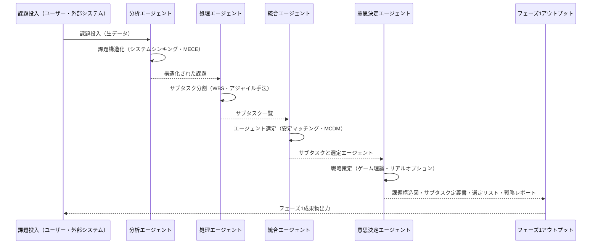

# フェーズ1『課題分解』統合設計書

## 目次
1. [概念構築（外面設計）](#1-概念構築外面設計)
2. [詳細構想設計案](#2-詳細構想設計案)
3. [システムプロセスフロー](#3-システムプロセスフロー)
4. [各エージェントの特性詳細とプロンプト設計](#4-各エージェントの特性詳細とプロンプト設計)
5. [実装仕様](#5-実装仕様)

---

## 1. 概念構築（外面設計）

### 1.1 なぜフェーズ1『課題分解』が必要か？

フェーズ1の目的は課題を明確に捉え、小単位へ分割し解決可能な状態に導くことにある。以下がその理由である。

- **課題の明確化**: 曖昧な問題を具体的で扱いやすい形に変換
- **効果的なリソース配分**: 適材適所によるリソースの最適活用
- **意思決定の迅速化**: 複雑な問題を単純化し、素早い判断を可能に
- **創造的解決策の促進**: 多角的アプローチによる革新的解決

### 1.2 フェーズ1が達成すべき目的

| No. | 目的 | 詳細な説明 |
|-----|------|------------|
| 1 | 課題の具体的な理解 | 課題の本質や背景を把握、解決ポイント特定 |
| 2 | 課題の構造化 | 問題を整理しロジカルな構造へ変換 |
| 3 | サブタスクへの分割 | 課題を解決可能な単位に分割 |
| 4 | 最適なエージェント選定 | 各サブタスクに最適なエージェントを特定 |
| 5 | 明確な戦略策定 | 明快で効果的な戦略を立案 |

### 1.3 フェーズ1で生成されるアウトプット

| アウトプット | 内容 | 活用方法 |
|-------------|------|----------|
| 課題構造図（ロジックツリー） | 課題の因果関係を示した図 | 全体共通認識形成 |
| サブタスク定義書 | タスクと条件を詳細記述した文書 | タスク配分や進捗管理 |
| エージェント選定リスト | サブタスクに最適なエージェント割当一覧 | リソース管理 |
| 課題解決戦略レポート | アプローチ、リスク分析、ロードマップ | 実行計画策定・意思決定 |

### 1.4 フェーズ1における主要プロセスの意義

#### 課題構造化
- 課題理解促進、問題見落とし防止
- 共通理解形成

#### サブタスク分割
- 解決可能サイズに落とし込み実行計画を可能に
- 責任範囲明確化

#### エージェント選定
- 各エージェント能力最大化、パフォーマンス向上
- 資源の最適配分

#### 戦略策定
- 目標達成の道筋を明示
- リスク評価・管理

### 1.5 フェーズ1の実施がもたらす価値

- **問題解決の迅速化**: 構造化により解決への道筋が明確に
- **資源の効率的利用**: 最適なエージェント配置による生産性向上
- **意思決定精度向上**: データと理論に基づく客観的判断
- **イノベーション促進**: 多様なエージェントの協調による創発

---

## 2. 詳細構想設計案

### 2.1 フェーズ1の目的
フェーズ1『課題分解』では、具体的な課題を理解し、サブタスクに分解し、最適なエージェントを選定し、戦略を決定する。

### 2.2 各プロセスの定義

#### 2.2.1 課題構造化 (Problem Structuring)
- **担当エージェント**: 分析エージェント (Analysis Agent)
- **主要特性**: 課題の抽象化・本質化能力
- **性格付け**:
  - システマティック型 (課題を網羅的・階層的に整理)
  - クリティカル型 (根本原因の深掘り)
- **理論・手法**:
  - システムシンキング
  - ロジックツリー・MECE

#### 2.2.2 サブタスク分割 (Task Decomposition)
- **担当エージェント**: 処理エージェント (Processing Agent)
- **主要特性**: タスクの論理的分割・並列化能力
- **性格付け**:
  - 構造化推進型 (適切粒度でタスク分割)
  - 柔軟適応型 (状況に応じた柔軟な分割)
- **理論・手法**:
  - 分割統治法
  - WBS、アジャイルスクラム

#### 2.2.3 エージェント選定 (Agent Selection)
- **担当エージェント**: 統合エージェント (Integration Agent)
- **主要特性**: マッチング・最適資源配分
- **性格付け**:
  - 調整型 (能力とタスクの的確なマッチング)
  - 効率追求型 (迅速で効率的な配分)
- **理論・手法**:
  - 安定マッチング理論
  - 多基準意思決定（AHP, TOPSIS）

#### 2.2.4 戦略策定 (Strategy Formulation)
- **担当エージェント**: 意思決定エージェント (Decision Agent)
- **主要特性**: 戦略的意思決定・リスク評価
- **性格付け**:
  - 保守戦略型 (安全で堅実な戦略)
  - 攻撃戦略型 (革新的でリスクを取る戦略)
- **理論・手法**:
  - ゲーム理論
  - リアルオプション理論

### 2.3 エージェント性格・特性マトリクス

| エージェント | 性格の例 | 特性（能力） | 使用理論・概念 |
|-------------|----------|-------------|---------------|
| 分析エージェント | システマティック型<br>クリティカル型 | 抽象化・本質化能力 | システムシンキング、MECE、ロジックツリー |
| 処理エージェント | 構造化推進型<br>柔軟適応型 | 論理的分割・並列計画 | 分割統治法、WBS、アジャイル手法 |
| 統合エージェント | 調整型<br>効率追求型 | マッチング・資源配分 | 安定マッチング理論、MCDM |
| 意思決定エージェント | 保守戦略型<br>攻撃戦略型 | 戦略策定・リスク評価 | ゲーム理論、リアルオプション理論 |

### 2.4 エージェント選定アルゴリズム詳細

#### エージェント選定アルゴリズム手順
1. 課題特性分析（必要能力、緊急度、重要度）
2. エージェント能力評価（過去実績、専門性、負荷状況）
3. 適合性スコア計算（タスク特性 × エージェント評価）
4. 安定マッチング（ゲール＝シャプレイ）
5. 負荷状況動的調整（リアルタイムタスク再配分）

#### 評価スコア算出式
```
スコア = (専門性スコア×0.4)+(実績スコア×0.3)+(1−負荷率)×0.3
```

---

## 3. システムプロセスフロー

### 3.1 エージェントの分類と役割

| エージェント名 | 主な役割 | 主な特性 |
|---------------|-----------|-----------|
| 分析エージェント（Analysis Agent）| 課題の構造化と本質的問題の抽出 | システム思考、MECE原則、ロジカルツリー |
| 処理エージェント（Processing Agent）| 課題を解決可能なサブタスクに分割 | 分割統治法、WBS、アジャイル手法 |
| 統合エージェント（Integration Agent）| タスクに適したエージェント選定・資源配分 | 安定マッチング理論、多基準意思決定、動的負荷調整 |
| 意思決定エージェント（Decision Agent）| 課題解決戦略の策定 | ゲーム理論、リアルオプション理論、リスク管理 |

### 3.2 システム内プロセスフロー

#### Step1: 課題入力（Human/System Interface）
- 課題がシステムに投入される（人間または外部システム経由）

#### Step2: 課題構造化（分析エージェント）
- 課題をシステムシンキングやMECE原則を用いて構造化
- ロジックツリーや因果ループ図で可視化

#### Step3: サブタスク分割（処理エージェント）
- 課題を実行可能なサブタスクに分割
- WBSやアジャイルスクラムでタスクの粒度調整

#### Step4: エージェント選定（統合エージェント）
- エージェントの能力データをもとに最適なマッチングを実施
- 専門性・負荷状況・実績を考慮して動的選定

#### Step5: 戦略策定（意思決定エージェント）
- 総合的な解決戦略を策定
- ゲーム理論、リスク分析、リアルオプション理論を使用

#### Step6: フェーズ1成果物生成・出力
- 以下の成果物を生成し次フェーズへ渡す
  - 課題構造図（ロジックツリー）
  - サブタスク定義書
  - エージェント選定リスト
  - 課題解決戦略レポート

### 3.3 エージェント間のコミュニケーション詳細

- **通信形式**: JSON形式のメッセージ
- **主なメッセージタイプ**:
  - request（処理要求）
  - response（処理結果）
  - notification（状態通知）

### 3.4 シーケンス図



### 3.5 技術的ポイント整理

- JSONベースの安全な通信プロトコル
- リアルタイム負荷監視と動的再配分
- エラー処理（サーキットブレーカー、デッドレターキュー）
- リアルタイムのパフォーマンス監視と分析

---

## 4. 各エージェントの特性詳細とプロンプト設計

### 4.1 分析エージェント（Analysis Agent）

#### 特性の深掘り
- **体系的思考**: 課題全体を俯瞰し、関連要素の関係性を明確化する
- **抽象化・本質化能力**: 表面的な問題から根本原因を抽出する
- **論理的整合性**: 矛盾のない一貫した論理構造を作成できる

#### 具体的特性例
- MECE（漏れなくダブりなく）の原則を厳密に適用
- システムシンキングを用いた課題の因果関係の可視化
- 課題を抽象化し、階層的なロジックツリーを構築

#### 推奨プロンプト例
```
『与えられた課題について、MECEの原則に従い、全ての要素を漏れなくかつダブりなく体系的に整理し、因果関係が明確なロジックツリーとして提示してください。さらに、問題の根本原因を抽象化し、本質的な課題を特定してください。』
```

### 4.2 処理エージェント（Processing Agent）

#### 特性の深掘り
- **論理的分割能力**: 課題を明確で実行可能なサブタスクに分割
- **柔軟な適応性**: タスクを柔軟に再編成・調整可能な能力
- **実行性重視**: 理論だけでなく、現実的なタスク粒度を設計

#### 具体的特性例
- WBSやアジャイル手法によるタスク分解
- 変更に迅速に対応できる柔軟なタスク管理
- 実行可能性と並列処理の観点からタスクを設計

#### 推奨プロンプト例
```
『提示された構造化された課題を元に、論理的かつ明確なサブタスク群に分割してください。分割したタスクは柔軟に変更可能であることを前提とし、具体的に実行可能なサイズで並列処理が可能な構造として定義してください。』
```

### 4.3 統合エージェント（Integration Agent）

#### 特性の深掘り
- **動的マッチング能力**: 状況に応じて動的にエージェント選定を最適化
- **効率性と迅速性**: エージェント能力とタスクを迅速にマッチングする
- **負荷状況のリアルタイム把握**: 各エージェントの現在の状態を即時に判断し調整

#### 具体的特性例
- 安定マッチングアルゴリズムを用いた選定
- 負荷分散アルゴリズムによるリアルタイム調整
- 複数基準（専門性、負荷、実績）によるスコアリング評価

#### 推奨プロンプト例
```
『与えられたサブタスクを各エージェントの専門性・実績・負荷状況に基づいて迅速かつ効率的に最適なエージェントにマッチングしてください。リアルタイムな負荷変動にも対応可能な動的な選定結果を提示してください。』
```

### 4.4 意思決定エージェント（Decision Agent）

#### 特性の深掘り
- **戦略的思考力**: 長期的視点を持ち、最適な解決戦略を構築
- **リスク評価能力**: 戦略の潜在的リスクを正確に評価
- **多角的視点の統合**: 多様な視点や情報を統合し、最終意思決定を行う

#### 具体的特性例
- ゲーム理論を用いた複数シナリオの比較検討
- リアルオプション理論に基づく柔軟な戦略立案
- リスク分析手法（定量・定性）を駆使し、安全かつ効果的な意思決定を実現

#### 推奨プロンプト例
```
『提示されたサブタスク群とエージェントの選定結果を基に、リスクとリターンのバランスを考慮し、複数のシナリオを評価した上で最適な戦略を策定してください。ゲーム理論やリアルオプション理論を活用し、革新的でかつ実行可能な意思決定を提示してください。』
```

### 4.5 各エージェント特性まとめ（比較表）

| エージェント名 | 主要特性 | 特性の強調ポイント |
|------------|----------|-----------------|
| 分析エージェント | 抽象化・構造化能力 | 課題の全体的理解と本質的原因の特定 |
| 処理エージェント | 柔軟なタスク分割能力 | 実行性重視のタスク分割と柔軟な対応力 |
| 統合エージェント | 動的選定・負荷調整能力 | 最適資源のリアルタイム調整 |
| 意思決定エージェント | 戦略策定・リスク評価能力 | 革新的で安全な意思決定 |

---

## 5. 実装仕様

### 5.1 メッセージフォーマット

```json
{
  "header": {
    "messageId": "uuid",
    "timestamp": "2024-01-01T00:00:00Z",
    "fromAgent": {
      "id": "agent-001",
      "type": "analysis"
    },
    "toAgent": {
      "id": "agent-002",
      "type": "processing"
    },
    "messageType": "request|response|notification",
    "correlationId": "task-001"
  },
  "payload": {
    "taskId": "task-001",
    "action": "analyze|process|decide|integrate",
    "data": {
      // エージェント固有のデータ
    }
  }
}
```

### 5.2 エージェント選定スコア算出

| 評価項目 | 重み | 評価内容 |
|---------|------|----------|
| 専門性スコア | 40% | タスクに対する専門知識の適合度、過去の類似タスクでの実績 |
| 実績スコア | 30% | 成功率、品質評価、処理速度 |
| 負荷率スコア | 30% | 現在の処理中タスク数、リソース使用率 |

### 5.3 実装優先順位

1. **第1段階**: 分析エージェント（基本的な課題構造化）
2. **第2段階**: 処理エージェント（タスク分割機能）
3. **第3段階**: 統合エージェント（基本的なマッチング）
4. **第4段階**: 意思決定エージェント（戦略策定）
5. **第5段階**: 全体統合と最適化

### 5.4 次の技術的ステップ

- プロトタイプ作成
- 選定アルゴリズム性能検証
- 通信プロトコル実装とセキュリティ確認
- パフォーマンステストとチューニング

---

## 付録：用語集

| 用語 | 説明 |
|-----|------|
| MECE | Mutually Exclusive Collectively Exhaustive（漏れなくダブりなく） |
| WBS | Work Breakdown Structure（作業分解構造） |
| AHP | Analytic Hierarchy Process（階層分析法） |
| TOPSIS | Technique for Order of Preference by Similarity to Ideal Solution |
| MCDM | Multi-Criteria Decision Making（多基準意思決定） |

---

*本設計書は、A2Aマルチエージェントシステムのフェーズ1『課題分解』の実装に向けた包括的なガイドラインです。*