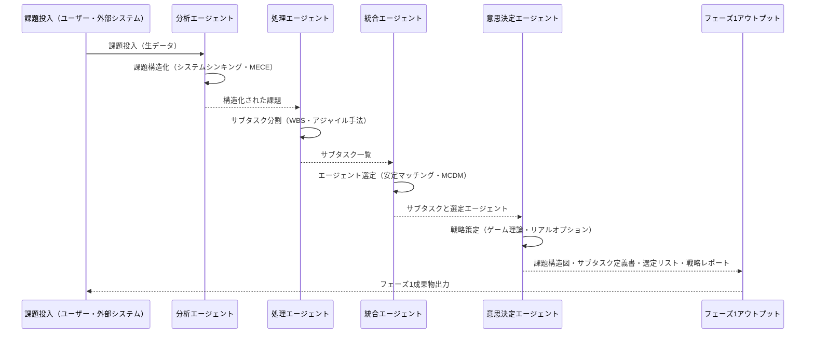

# フェーズ1『課題分解』システム プロセスフロー

## Ⅰ. エージェントの分類と役割

| エージェント名 | 主な役割 | 主な特性 |
|---------------|-----------|-----------|
| 分析エージェント（Analysis Agent）| 課題の構造化と本質的問題の抽出 | システム思考、MECE原則、ロジカルツリー |
| 処理エージェント（Processing Agent）| 課題を解決可能なサブタスクに分割 | 分割統治法、WBS、アジャイル手法 |
| 統合エージェント（Integration Agent）| タスクに適したエージェント選定・資源配分 | 安定マッチング理論、多基準意思決定、動的負荷調整 |
| 意思決定エージェント（Decision Agent）| 課題解決戦略の策定 | ゲーム理論、リアルオプション理論、リスク管理 |

## Ⅱ. システム内プロセスフロー

### Step1: 課題入力（Human/System Interface）
- 課題がシステムに投入される（人間または外部システム経由）。

### Step2: 課題構造化（分析エージェント）
- 課題をシステムシンキングやMECE原則を用いて構造化。
- ロジックツリーや因果ループ図で可視化。

### Step3: サブタスク分割（処理エージェント）
- 課題を実行可能なサブタスクに分割。
- WBSやアジャイルスクラムでタスクの粒度調整。

### Step4: エージェント選定（統合エージェント）
- エージェントの能力データをもとに最適なマッチングを実施。
- 専門性・負荷状況・実績を考慮して動的選定。

### Step5: 戦略策定（意思決定エージェント）
- 総合的な解決戦略を策定。
- ゲーム理論、リスク分析、リアルオプション理論を使用。

### Step6: フェーズ1成果物生成・出力
- 以下の成果物を生成し次フェーズへ渡す。
  - 課題構造図（ロジックツリー）
  - サブタスク定義書
  - エージェント選定リスト
  - 課題解決戦略レポート

## Ⅲ. エージェント間のコミュニケーション詳細

- JSON形式のメッセージで通信。
- 主なメッセージタイプ:
  - request（処理要求）
  - response（処理結果）
  - notification（状態通知）

## Ⅳ. シーケンス図

## Ⅴ. 技術的ポイント整理

- JSONベースの安全な通信プロトコル。
- リアルタイム負荷監視と動的再配分。
- エラー処理（サーキットブレーカー、デッドレターキュー）。
- リアルタイムのパフォーマンス監視と分析。

## Ⅵ. 次の技術的ステップ

- プロトタイプ作成。
- 選定アルゴリズム性能検証。
- 通信プロトコル実装とセキュリティ確認。

